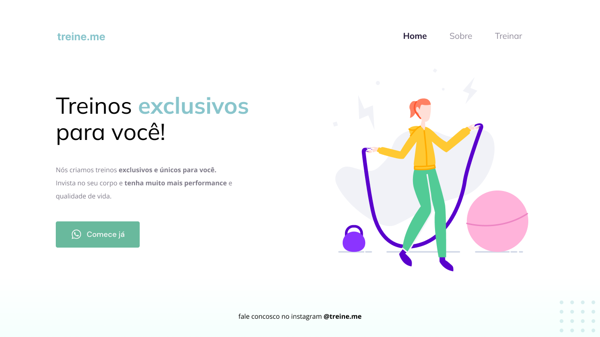

<h1 align="center"> Treine.me </h1>

Projeto 2 do Curso Explorer realizado através da plataforma da Rockeatseat.  

  <a href="#-tecnologias">Tecnologias</a>&nbsp;&nbsp;&nbsp;|&nbsp;&nbsp;&nbsp;
  <a href="#-projeto">Projeto</a>&nbsp;&nbsp;&nbsp;|&nbsp;&nbsp;&nbsp;

 

  

## 🚀 Tecnologias

Esse projeto foi desenvolvido com as seguintes tecnologias:

- HTML e CSS
- Figma

## 💻 Projeto

O projeto é uma página comercial para criação de treinos e atividade fisica de uma instituição
- [Acesse o projeto aqui]( https://gustavomai4.github.io/Treine.me/)

---

Projeto criado a partir do Explorer da Rocketseat 
